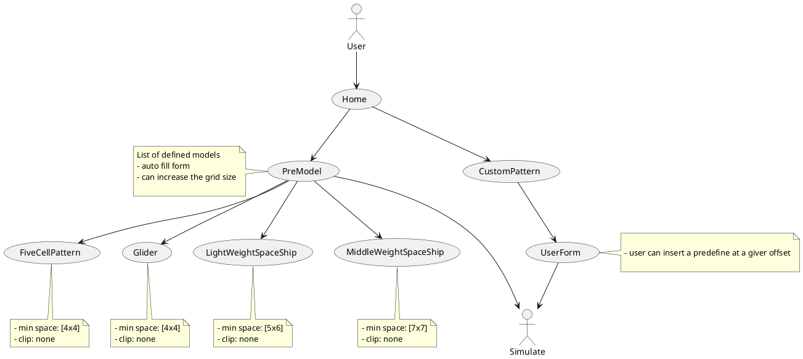

# game_of_life

> Build during the curfew(Bangladesh), thousands of students where killed and got injured.

for more search tag `SaveBangladeshStudent`

[Game concept](https://pi.math.cornell.edu/~lipa/mec/lesson6.html)

- If the cell is alive, then it stays alive if it has either 2 or 3 live neighbors

- If the cell is dead, then it springs to life only in the case that it has 3 live neighbors

 

 User flow

